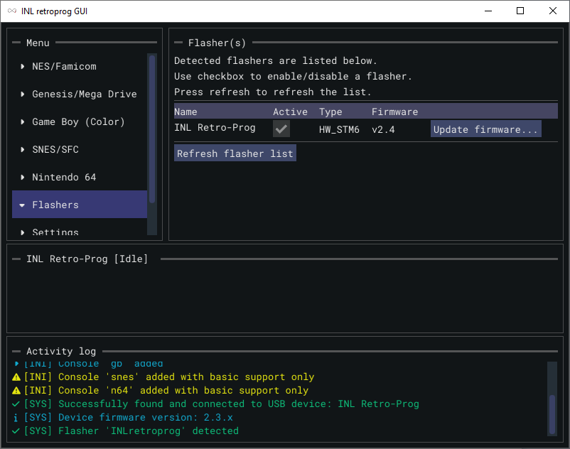
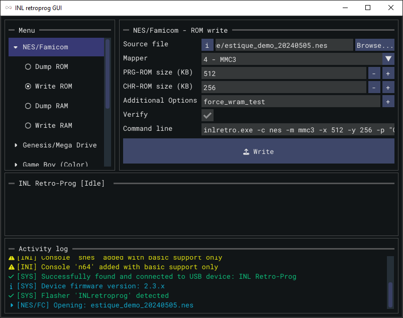
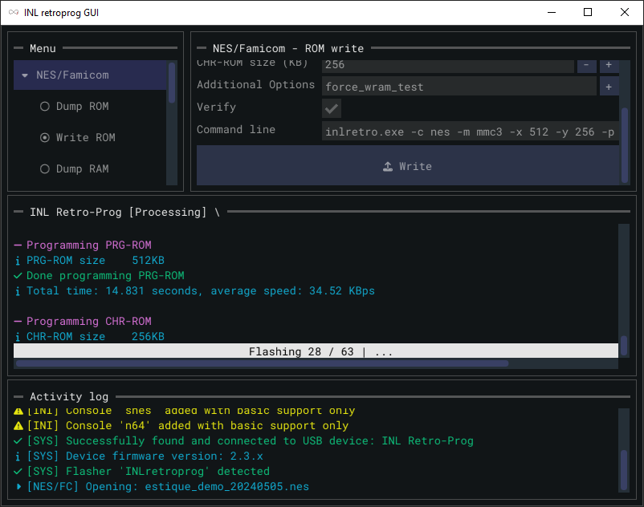
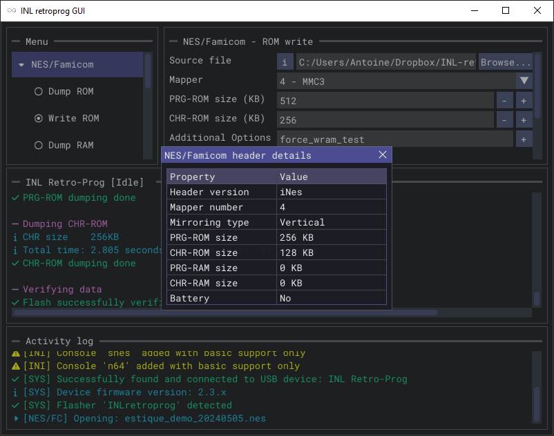

# INLretro Programmer-Dumper (CLI + GUI)

This project is based on the original [INLretro programmer-dumper](https://gitlab.com/InfiniteNesLives/INL-retro-progdump) by InfiniteNesLives.

It provides both a command-line interface (CLI) and a graphical user interface (GUI) for interacting with INLretro hardware programmers/dumpers.

**If you already own an INLretro programmer-dumper and want to switch to this CLI/GUI solution, please read the _[IMPORTANT NOTE](#important-note)_ below.**

---

## Features

- Dump cartridge ROMs and program compatible flash cartridges.
- Back up and restore cartridge save data on supported systems.
- Choose between a graphical interface (GUI) and a command-line interface (CLI).
- Manage multiple connected INLretro programmers.
- Update your programmer's firmware directly from the GUI or CLI.
- Available on Windows, Linux, and macOS.

See the compatibility table below for supported systems, mappers, and operations.

---

## Console/mapper support

| System           | Mapper               | ROM dump | ROM write | RAM dump | RAM write |
| ---------------- | -------------------- | -------- | --------- | -------- | --------- |
| NES / FC         | 0 - NROM             | ✓        | ✓         | −        | −         |
|                  | 1 - MMC1             | ✓        | ✓         | ✓        | ✓         |
|                  | 2 - UxROM            | ✓        | ✓         | −        | −         |
|                  | 3 - CxROM            | ✓        | ✓         | −        | −         |
|                  | 4 - MMC3             | ✓        | ✓         | ✓        | ✓         |
|                  | 5 - MMC5             | ✓        | ✓         | ✓        | ✓         |
|                  | 9 - MMC2             | ✓        | ✓         | ✓        | ✓         |
|                  | 10 - MMC4            | ✓        | ✓         | ✓        | ✓         |
|                  | 18 - SS88006         | ✓        | ✓         | ✓        | ✓         |
|                  | 24 - VRC6a           | ✓        | ✓         | ✓        | ✓         |
|                  | 26 - VRC6b           | ✓        | ✓         | ✓        | ✓         |
|                  | 28 - Action 53       | ✓        | ✓         | −        | −         |
|                  | 30 - UNROM-512       | ✓        | ✓         | −        | −         |
|                  | 34 - BNROM           | ✓        | ✓         | −        | −         |
|                  | 69 - FME-7 / 5A / 5B | ✓        | ✓         | ✓        | ✓         |
|                  | 111 - GTROM          | ✓        | ✓         | −        | −         |
|                  | 682 - Rainbow        | ✓        | ✓         | ✓        | ✓         |
|                  |                      |          |           |          |           |
| Game Boy (Color) | 32 KB                | ✓        | ✓         | ✓        | ✓         |
|                  | MBC1                 | ✓        | ✓         | ✓        | ✓         |
|                  | MBC5                 | ✓        | ✓         | ✓        | ✓         |
|                  |                      |          |           |          |           |
| Genesis / MD     | 32 Mb (4 MB)         | ✓        | ✓         | ✓        | ✓         |
|                  | SSF2                 | ✓        | ✓         | ✓        | ✓         |
|                  |                      |          |           |          |           |
| SNES / SFC       | LoROM / HiROM        | ✓        | ✓         | ✗        | ✗         |
|                  |                      |          |           |          |           |
| N64              |                      | ✓        | ✗         | ✗        | ✗         |

✓: supported / ✗: not supported yet / −: not applicable

ROM writing requires a compatible flash cartridge or development board.  
Support may vary depending on the cartridge hardware.

Need support for another system or mapper? [Let us know by opening an issue](https://github.com/BrokeStudio/INLretro/issues).

---

## Screenshots

---

## Important note

If you own an INLretro programmer-dumper and want to use this CLI/GUI solution, please follow these steps:

- If you're on Windows you need to install the new driver:
  - Go to the `DriverPackages/` folder in the downloaded release, or [`host/drivers/Windows/DriverPackages/`](host/drivers/Windows/DriverPackages/) in the source repository
  - Execute `InstallDriver.exe`
- You need to update the flasher's firmware so it's compatible with the CLI/GUI
  - Using the CLI: run one of these commands:
    - 6-connector flasher: `INLretro -s scripts/inlretro_fwupdate.lua -p firmware/inlretro_stm6.bin`
    - NESmaker flasher: `INLretro -s scripts/inlretro_fwupdate.lua -p firmware/inlretro_stmn.bin`
  - Using the GUI:
    - Go to the `Flashers` menu
    - Make sure your flasher is plugged in
    - Refresh the list if you can't find your flasher in the list
    - Click on `Update firmware` and select your flasher model

---

## Troubleshooting

### My programmer does not appear in the GUI

- On Windows, make sure you have installed the driver included with the release.
- Check the USB connection.
- Open the `Flashers` menu and refresh the device list.

### My programmer is reported as incompatible

Follow the [firmware update instructions](#important-note) and select the correct programmer model.

If the problem persists, open an issue with your operating system, application version, programmer model, and any error messages.

---

## Credits

Developed by Antoine GOHIN / Broke Studio.

This project is based on:

- [INLretro prog-dump](https://gitlab.com/InfiniteNesLives/INL-retro-progdump) by InfiniteNesLives

This project uses:

- [libusb](https://libusb.info/)
- [SDL2](https://www.libsdl.org/)
- [Dear ImGui](https://github.com/ocornut/imgui)
- [Premake](https://premake.github.io/)

This project uses the following fonts:

- **Roboto Mono Regular**
  Licensed under the [Apache License, Version 2.0](host/GUI/fonts/RobotoMonoRegular-License.txt).
  Copyright © Google.

- **Rubik Regular**
  Licensed under the [SIL Open Font License, Version 1.1](host/GUI/fonts/RubikRegular-License.txt).
  Copyright © The Rubik Project Authors.

---

## Compiling

- CLI and GUI: [host build guide](host/COMPILING.md).
- Programmer firmware: [firmware build guide](firmware/COMPILING.md).

---

## License

INLretro CLI/GUI is licensed under the [GNU General Public License, version 3 or later](LICENSE).

Copyright (C) 2024-2026 Broke Studio

This program is free software: you can redistribute it and/or modify it under the terms of the GNU General Public License as published by the Free Software Foundation, either version 3 of the License, or (at your option) any later version.

This program is distributed in the hope that it will be useful, but WITHOUT ANY WARRANTY; without even the implied warranty of MERCHANTABILITY or FITNESS FOR A PARTICULAR PURPOSE. See the GNU General Public License for more details.

You should have received a copy of the GNU General Public License along with this program. If not, see http://www.gnu.org/licenses/.

---

## Support & feedback

For bug reports and requests for additional system or mapper support, [open an issue](https://github.com/BrokeStudio/INLretro/issues).

For bug reports, please include:

- Your operating system and application version.
- Your programmer model and firmware version.
- The cartridge, mapper, and operation involved.
- Steps to reproduce the problem and any error messages.

You can also join the [Broke Studio Discord server](https://discord.gg/FffVMAuhTX) for questions and discussion.
